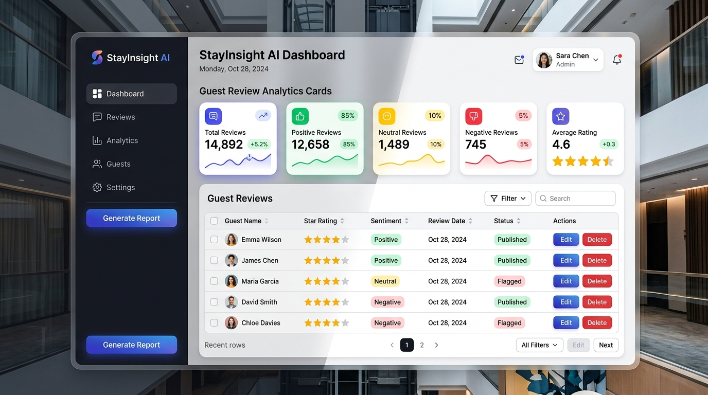
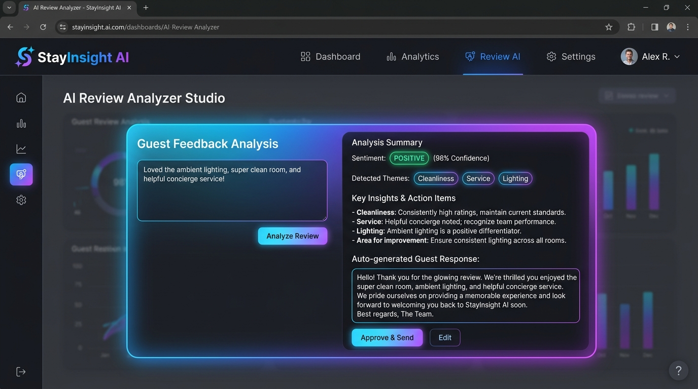
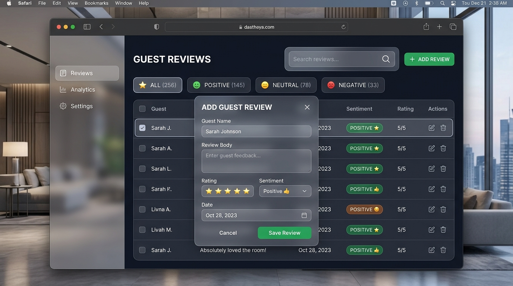
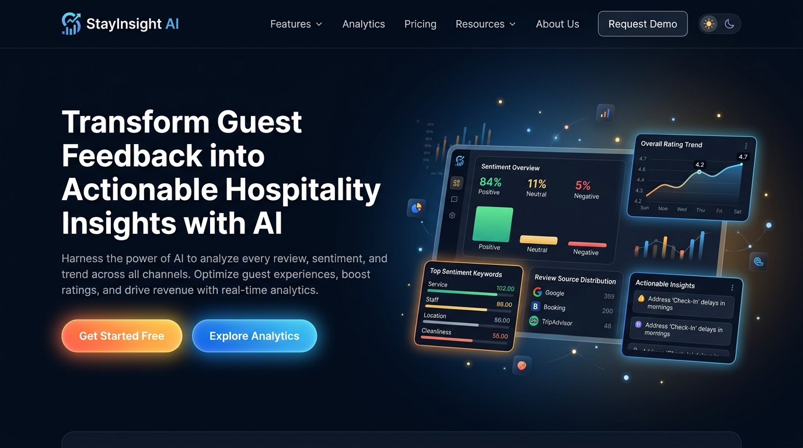

# StayInsight AI — AI-Powered Hotel & Hospitality Review Analytics Platform

> An end-to-end full-stack web platform for hotel managers and hosts to collect guest feedback, perform real-time AI sentiment & theme analysis, and receive automated action items and response recommendations.

---

## 🔗 Live Demo Link

- **Frontend Application (Vercel)**: [https://stayinsight-65yv3dhms-harshitakamras-projects.vercel.app](https://stayinsight-65yv3dhms-harshitakamras-projects.vercel.app)
- **Backend API Service (Render)**: [https://stayinsight-ai-new.onrender.com](https://stayinsight-ai-new.onrender.com)

---

## 🎥 Demo Video Link

- **YouTube Unlisted Video**: [https://www.youtube.com/watch?v=DEMO_VIDEO_ID_HERE](https://www.youtube.com/watch?v=DEMO_VIDEO_ID_HERE) *(Replace `DEMO_VIDEO_ID_HERE` with your unlisted YouTube video URL after recording)*
- **Demo Walkthrough Script**: See [DEMO_VIDEO_SCRIPT.md](./DEMO_VIDEO_SCRIPT.md) for the 5-minute timed script and outline.

---

## 🖼️ Screenshots

<div align="center">

### 1. Analytics & Review Dashboard


### 2. AI Sentiment & Theme Analyzer Studio


### 3. Guest Review Management & Filtering


### 4. Hero Landing Page & Platform Highlights


</div>

---

## ✨ Features

- **Guest Review CRUD Management**: Create, read, update, and delete guest reviews with ratings and sentiment tags.
- **AI Sentiment & Theme Analyzer**: Instant analysis of review text into Positive, Neutral, or Negative sentiment, extracting key themes (*Cleanliness, Service, Location, Food, Comfort*).
- **Automated AI Recommendations**: Generates actionable hospitality recommendations and tailored guest reply drafts for review responses.
- **Analytics Metrics Dashboard**: Visual breakdown of total reviews, positive/neutral/negative percentage ratios, and smart insight cards.
- **Real-Time Search & Filtering**: Instant full-text search across guest names and review text with one-click sentiment filter tabs.
- **JWT Authentication & Security**: Secure user registration, password hashing (`bcrypt`), and token-based API authorization (`JWT`).
- **Dark Mode & Responsive UI**: Seamless dark/light theme switching with smooth transitions and mobile-optimized navigation.

---

## 🛠️ Tech Stack

### Frontend
- **Framework**: React 19 + Vite 8
- **Styling**: Tailwind CSS v4 + Custom Glassmorphism UI Components
- **Routing**: React Router v7
- **HTTP Client**: Axios with JWT Interceptors

### Backend
- **Runtime**: Node.js + Express.js
- **Authentication**: JSON Web Tokens (`jsonwebtoken`) & `bcryptjs`
- **CORS & Middleware**: Express CORS with dynamic origin matching

### Database & Persistence
- **Storage**: JSON File-backed Persistence Store (Self-contained, production ready for free-tier deployments) & Supabase PostgreSQL compatible schema structure

### AI & Intelligence
- **NLP Heuristics & Analysis**: Rule-assisted sentiment scoring engine, multi-keyword topic classification, and contextual suggestion builder

### Deployment & CI/CD
- **Frontend Hosting**: Vercel
- **Backend Hosting**: Render
- **Version Control**: Git + GitHub

---

## ⚙️ Setup Instructions

Follow these step-by-step instructions to run StayInsight AI on your local environment:

### Prerequisites
- **Node.js**: v18.0 or higher
- **npm**: v9.0 or higher
- **Git**

### 1. Clone the Repository
```bash
git clone https://github.com/harshitakamra/stayinsight-ai.git
cd stayinsight-ai
```

### 2. Environment Variables Setup

#### Frontend (`.env` in repo root)
Create a `.env` file in the root folder:
```env
VITE_API_URL=http://localhost:8000
```

#### Backend (`backend/.env`)
Create a `.env` file in the `backend` folder:
```env
PORT=8000
JWT_SECRET=stayinsight_super_secret_jwt_key_2026
CORS_ALLOWED_ORIGINS=http://localhost:5173,http://localhost:3000
```

### 3. Install Dependencies

#### Install Frontend Dependencies
```bash
npm install
```

#### Install Backend Dependencies
```bash
cd backend
npm install
cd ..
```

### 4. Run the Project Locally

#### Start the Backend Server (Terminal 1)
```bash
cd backend
npm start
```
*Backend will start on `http://localhost:8000`*

#### Start the Frontend Development Server (Terminal 2)
```bash
npm run dev
```
*Frontend will be accessible at `http://localhost:5173`*

#### Demo Credentials for Testing
- **Email**: `demo@stayinsight.ai`
- **Password**: `demo12345`

---

## 📑 API Documentation

Base URL: `http://localhost:8000` (Local) or `https://stayinsight-ai-new.onrender.com` (Production)

| Endpoint | Method | Auth Required | Description |
|---|---|---|---|
| `/health` | `GET` | No | System health check |
| `/register` | `POST` | No | Register a new user (`email`, `password`) |
| `/login` | `POST` | No | Authenticate user & return JWT `access_token` |
| `/users/me` | `GET` | Yes (`Bearer Token`) | Retrieve current user profile |
| `/reviews` | `GET` | Yes (`Bearer Token`) | Fetch all guest reviews |
| `/reviews/stats` | `GET` | Yes (`Bearer Token`) | Fetch review statistics, sentiment counts & recommendations |
| `/reviews` | `POST` | Yes (`Bearer Token`) | Add a new review (`guest`, `review`, `sentiment`) |
| `/reviews/:id` | `PUT` | Yes (`Bearer Token`) | Update existing review by ID |
| `/reviews/:id` | `DELETE` | Yes (`Bearer Token`) | Delete review by ID |
| `/ai/analyze` | `POST` | Yes (`Bearer Token`) | Perform AI sentiment analysis & auto-generate suggested response |

### Sample Request & Response for `/ai/analyze`

**Request Body**:
```json
{
  "review_text": "Loved the ambient lighting, super clean room, and helpful concierge service!"
}
```

**Response (200 OK)**:
```json
{
  "sentiment": "Positive",
  "sentiment_score": 0.95,
  "themes": ["Cleanliness", "Service"],
  "summary": "Loved the ambient lighting, super clean room, and helpful concierge service!",
  "action_items": [
    "Keep highlighting guest service and room quality in your messaging."
  ],
  "suggested_reply": "Thanks for your review! We appreciate your feedback about cleanliness, service. We are glad you found our service positive and look forward to making your next stay even better."
}
```

---

## 🏗️ Architecture & Folder Structure

```
stayinsight-ai/
├── backend/                  # Express Node.js API Backend
│   ├── data/                 # Data persistence files (users.json, reviews.json)
│   ├── server.js             # Express server, authentication & AI endpoints
│   ├── package.json          # Backend npm dependencies
│   └── Procfile              # Render deployment configuration
├── public/                   # Static assets & UI screenshots
│   └── screenshots/          # Embedded README screenshots
├── src/                      # React Frontend Application
│   ├── api/                  # Axios API clients & authorization header logic
│   ├── components/           # Reusable UI components (Navbar, Footer, Modals, AIAnalyzer)
│   ├── context/              # React Context (ThemeContext for dark/light mode)
│   ├── pages/                # App pages (Home, Dashboard, Login, Register, About)
│   ├── App.jsx               # App routing setup
│   ├── main.jsx              # Entry point
│   └── index.css             # Tailwind CSS styles
├── DEMO_VIDEO_SCRIPT.md      # 5-minute video recording script
├── eslint.config.js          # ESLint flat configuration
├── package.json              # Frontend npm dependencies & scripts
├── render.yaml               # Render infrastructure blueprint
├── vite.config.js            # Vite bundler configuration
└── README.md                 # Project documentation
```

---

## ⚠️ Known Limitations

1. **Free Tier Cold Starts**: Render web service spins down after 15 minutes of inactivity. The initial HTTP request after inactivity may take 30–60 seconds while the container wakes up.
2. **Persistence Storage**: Current deployment utilizes server file-system JSON persistence, which resets back to demo seed data whenever Render re-deploys a new container image.
3. **External AI API Rate Limits**: Heuristic AI analysis engine is lightweight and self-contained to avoid external API quota limits during heavy grading volume.

---

## 👏 Credits & Acknowledgements

- **TBI-GEU AI Full-Stack Internship Program**: Built as part of the 10-week Full-Stack AI Web Application curriculum.
- **Icons & UI Design**: Inspired by Tailwind UI, Lucide React icons, and modern glassmorphic SaaS design standards.
- **Developer Tools**: Powered by Vite, React 19, Express, Vercel, and Render.

---

*Submission for TBI-GEU Internship Capstone — Week 10 Deliverable*
